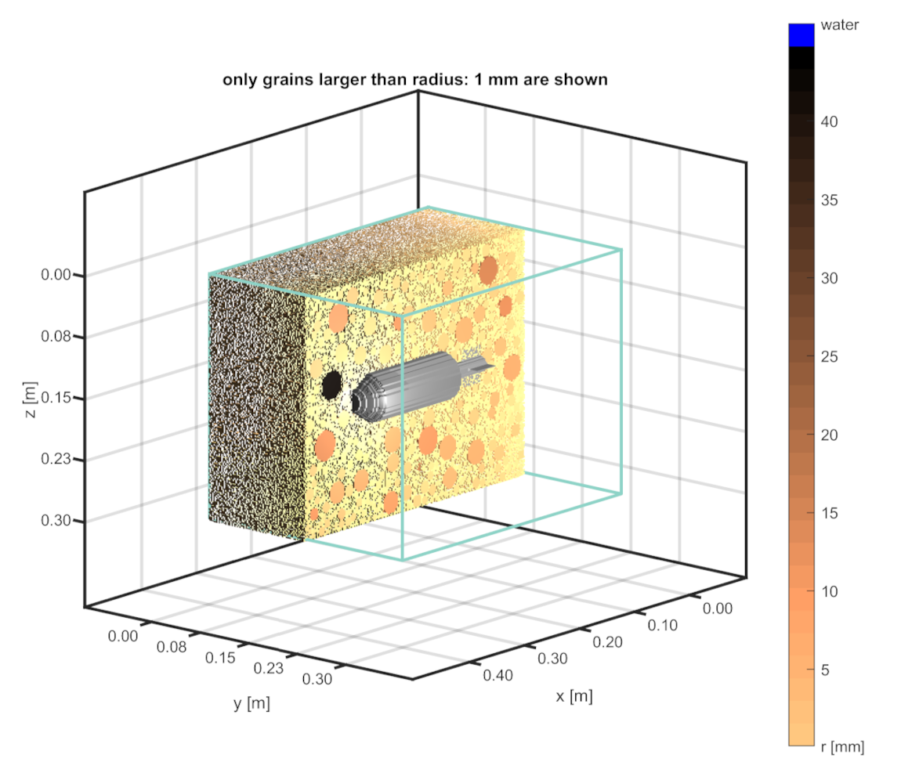

## GPRGRAVEL

A simple GPR gravel generator

- - -

### Table of Contents
1. [About](#about)
2. [Requirements](#requirements)
3. [Installation](#installation)
4. [Usage](#usage)
5. [ToDo](#todo)
6. [Cite as & References](#references)
7. [Changelog](CHANGELOG.md)

- - -

### About

**GPRGRAVEL** is a set of MATLABTM tools to generate grain (gravel) "packings" to be used with 3D FDTD GPR simulation software [**gprMax**](https://www.gprmax.com/). The "packings" are created based on user defined grain size distributions. Please note that **GPRGRAVEL** creates a "packing" by randomly placing grains at arbitrary positions inside a given container. No gravimetric settlement of the grains is applied.

#### Basic features:
1. Choose between different grain shapes (*Sphere* or *Ellipsoid*)
2. Set a desired porosity and corresponding water and air fractions
3. Let the surface dip into x- or y-direction
4. Place an object (target) into the domain
5. Set a water saturation profile (*linear* or *exponential*)
6. etc.

<!---

-->

| 

 | 

|:---:| :---: |
| GUI example with a mortar as target | Output volume with grains and target (for visibility reasons water is not shown and domain is cut at the center) |

- - -

### Requirements

In order to work properly you need to meet the following requirements:

1. The [Mathworks](https://www.mathworks.com) MATLABTM software development environment (tested with R2019a and newer)
2. The GUI Layout Toolbox (get it from [FEX](https://de.mathworks.com/matlabcentral/fileexchange/47982-gui-layout-toolbox)) (required)
3. `findjobj` (get it from [FEX](https://de.mathworks.com/matlabcentral/fileexchange/14317-findjobj-find-java-handles-of-matlab-graphic-objects)) (required)
4. `inpolyhedron` (get it from [FEX](https://de.mathworks.com/matlabcentral/fileexchange/37856-inpolyhedron-are-points-inside-a-triangulated-volume)) (required)
5. `VoxelSurf` (get it from [FEX](https://de.mathworks.com/matlabcentral/fileexchange/66204-voxelsurf)) (optional)

#### Operating System

I tested it successfully with Windows 10 (64bit) and Matlab R2019a and newer. Always with the latest version of the GUI Layout Toolbox (current version is afaik v2.3.6)

**NOTE:** So far I did not test anything on Linux or a Mac. If you get it to work on either of the two systems (which it basically should I guess) please let me know.

- - -

### Installation

1. It is recommended to install the GUI Layout Toolbox directly into MATLABTM via the mltbx-file (but it should also work via the old-school way of adding the toolbox folders to the MATLABTM path)
2. To use **GPRGRAVEL** you just need to place the `GPRGRAVEL` folder from  the git repository on your hard drive and use the start script `startGPRGRAVEL` (within this script all necessary **GPRGRAVEL** folders are added to the MATLABTM path)

- - -

### Usage

1. By executing the start script (see above)
2. Simply type `GPRGRAVEL` on the MATLABTM prompt (make sure the `GPRGRAVEL` folder is on the MATLABTM path)

3. Check the example scripts for the usage of the core functions without the GUI (inside the `scripts` folder)

- - -

### ToDo

In no particular order and without guarantee that it will ever happen :-) :

1. Clean-up (refactoring) of the code base
2. A manual
3. ... 

- - -

### Cite as
If you use GPRGRAVEL for your research, please cite it as:

Thomas Hiller. (2023, September 05). ThoHiller/gprgravel: v0.1.1 (Version v0.1.1). Zenodo. [https://doi.org/10.5281/zenodo.8148692]

Note: Even though the version number might change due to updates, this DOI is permanent (represents all versions) and always links to the latest version.

### References
1. Stadler, S., Schennen, S., Hiller, T. and Igel, J., "Realistic Simulation of GPR for Landmine and IED Detection Including Antenna Models, Soil Dispersion and Heterogeneity", Near Surface Geophysics (*submitted*), 2023.

- - -

 MATLAB is a registered trademark of The Mathworks, Inc. 
